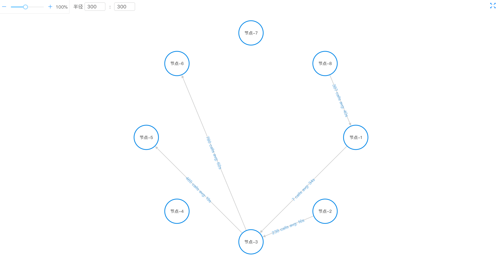

### 运行

开发环境下运行命令<br />
使用浏览器打开[http://localhost:3000](http://localhost:3000)

```
yarn start
```


### 打包

打包命令!
```
yarn build

```
### 效果图



### 项目目录
```
.
├── README.md
├── build
├── config-overrides.js
├── mock
├── package.json
├── public
├── src
│   ├── assets
│   ├── components
│   ├── index.js
│   ├── pages
│   ├── serviceWorker.js
│   └── utils
└── yarn.lock
```